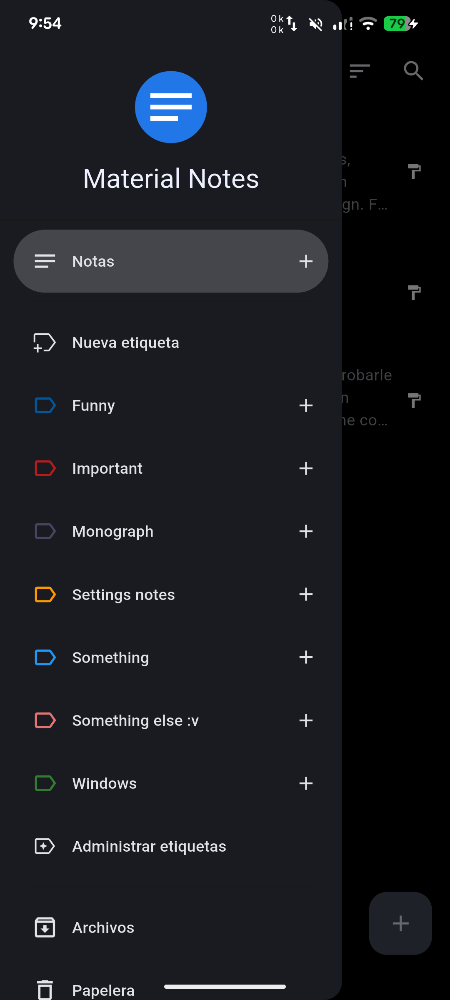

# Local Material Notes

Notas locales, simples y con material design.
Sin nube, sin cuentas y sin rastreo.

*Fork personal de [Local Material Notes](https://github.com/maelchiotti/LocalMaterialNotes) (licencia MIT).*

## Lo que añade este fork

| | |
|---|---|
| ➕ **Botones discretos** | en el menú lateral, crean notas de texto enriquecido (también con etiqueta) |
| 🏷️ **Etiquetas al instante** | las etiquetas nuevas aparecen en el menú al momento |
| 🚪 **Menú en cada arranque** | el menú lateral se abre automáticamente |
| ⚡ **Rendimiento** | mejoras en notas largas |
| 📦 **Builds propios** | APKs publicados en Releases con su changelog |

## Capturas

<table>
  <tr>
    <td align="center"> <em>Menú lateral con botones discretos</em></td>
    <td align="center"> <em>Etiquetas nuevas visibles al instante</em></td>
  </tr>
</table>

## Compilación

1. Configura los secretos del repositorio:
   - `ANDROID_KEYSTORE`: keystore de firma codificado en base64.
   - `ANDROID_KEY_PROPERTIES`: contenido del archivo `key.properties`.
2. Ejecuta **Actions → build-release → Run workflow**.
3. Los APK se adjuntan a la release `v{versión}` junto con su changelog
   (en la mayoría de teléfonos: `app-arm64-v8a-release.apk`).

## Licencia y atribución

Proyecto original de [maelchiotti](https://github.com/maelchiotti) bajo licencia MIT
(vea [LICENSE](LICENSE)). Este fork conserva la licencia y la atribución.
